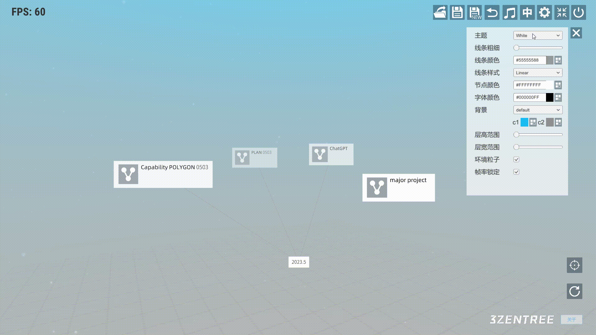
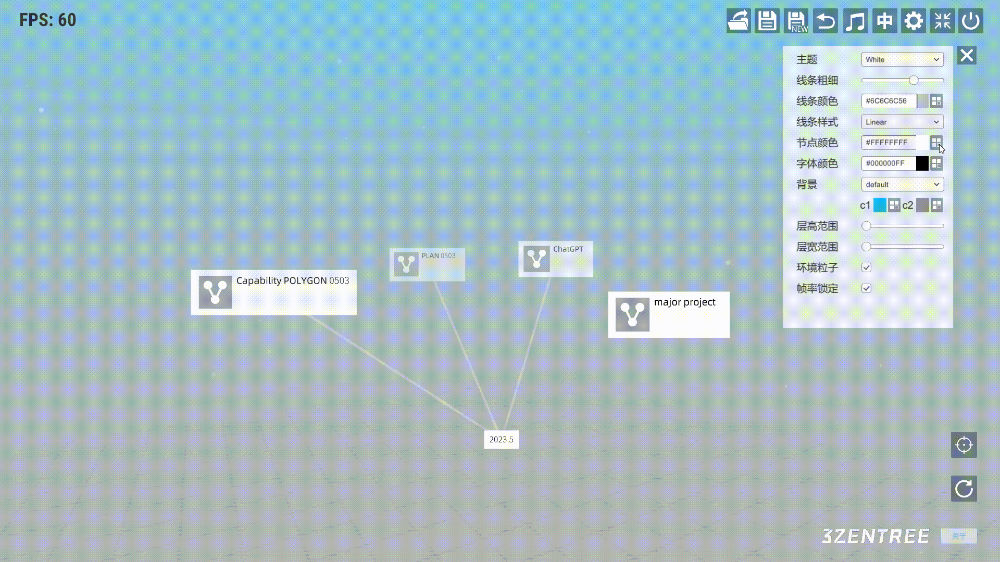
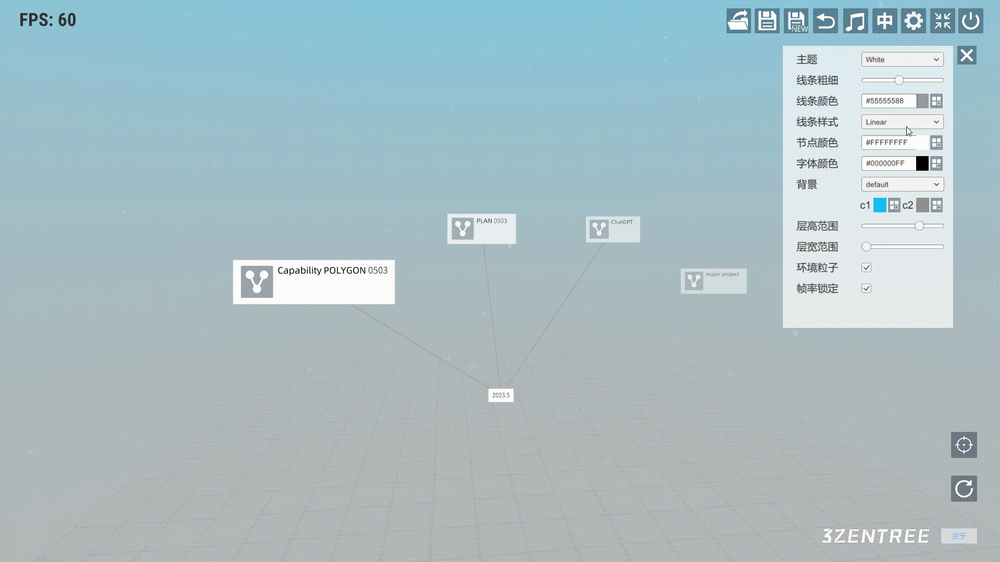
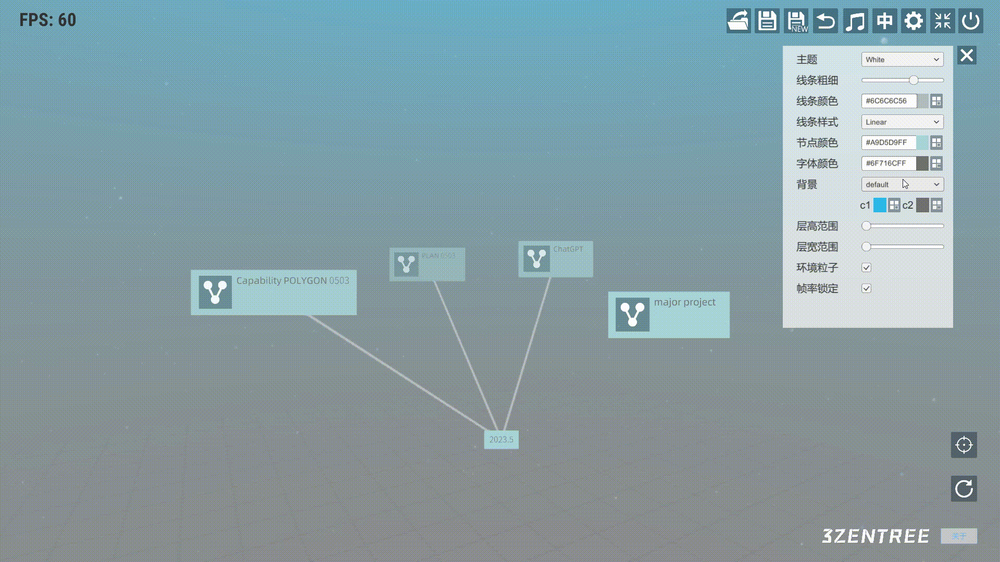
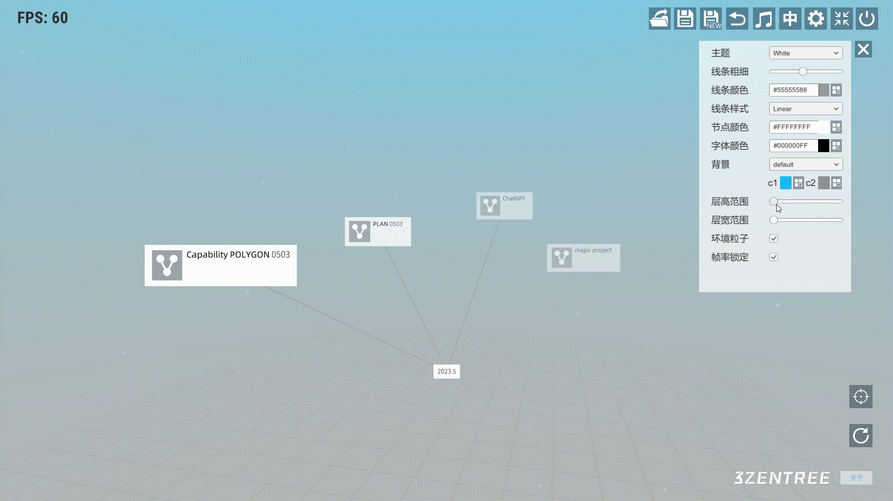
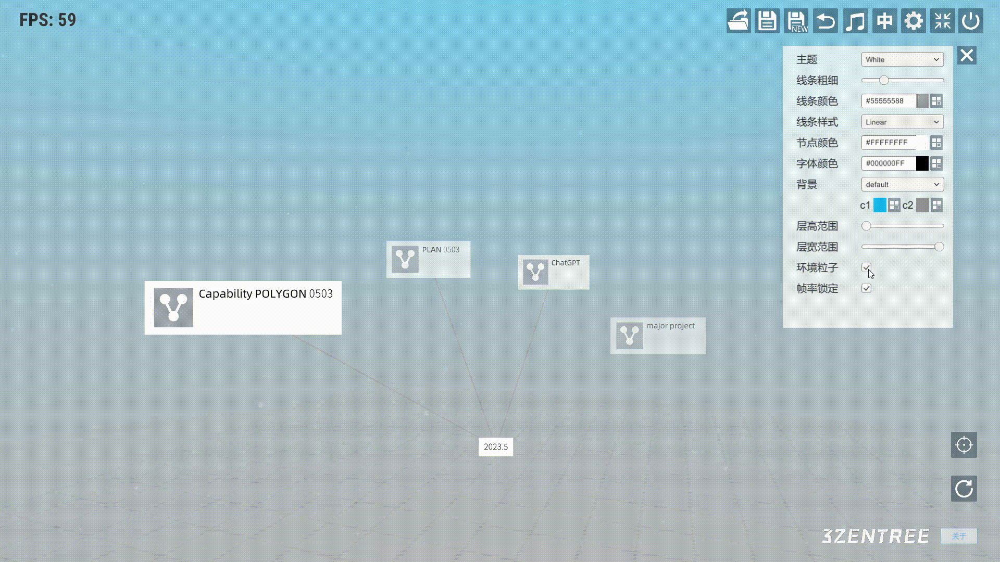

# 三生之树操作指南(v0.2b) - 配置菜单

## 
配置菜单

* ## 主题
&emsp;&emsp;点击下拉菜单可以选择想要的UI主题(不影响结点)

* ## 连线粗细
&emsp;&emsp;滑动条可以改变连接线粗细

* ## 连线颜色
&emsp;&emsp;点击右侧图标可打开颜色选择面板，可以调整连线颜色与透明度

* ## 线条样式
&emsp;&emsp;可点击下拉菜单选择线条样式：直线与两种曲线

* ## 结点颜色
* 

* ## 字体颜色

* ## 背景
&emsp;&emsp;默认背景是渐变填充的，选择两种颜色再实现渐变效果

&emsp;&emsp;也可以点击下拉菜单选择其他背景

* ## 层高范围
&emsp;&emsp;可以通过滑动条调整结点生成的纵向范围

* ## 层宽范围
&emsp;&emsp;可以通过滑动条调整结点生成的横向范围

* ## 环境粒子
&emsp;&emsp;勾选可开启粒子，取消勾选可关闭粒子

* ## 帧率锁定
&emsp;&emsp;勾选可锁定60帧，取消勾选可解除限制

## 视频演示
<a href="https://www.bilibili.com/video/BV1KN411D74N/?spm_id_from=333.337.search-card.all.click" target="_blank">全局操作</a>
