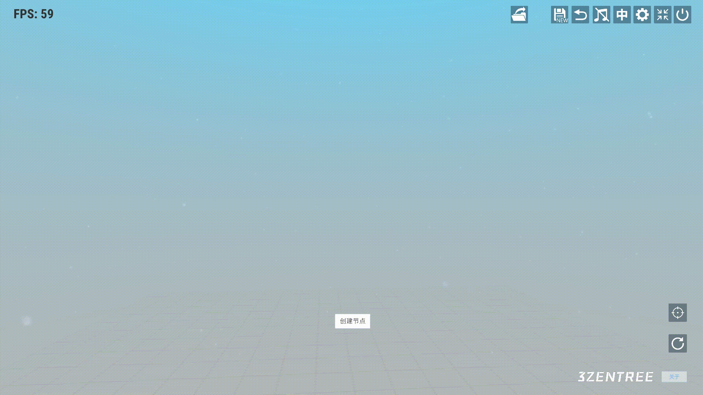
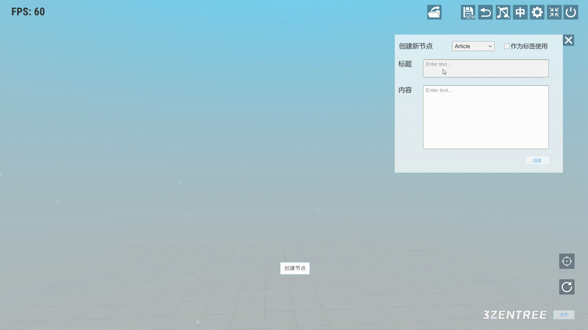
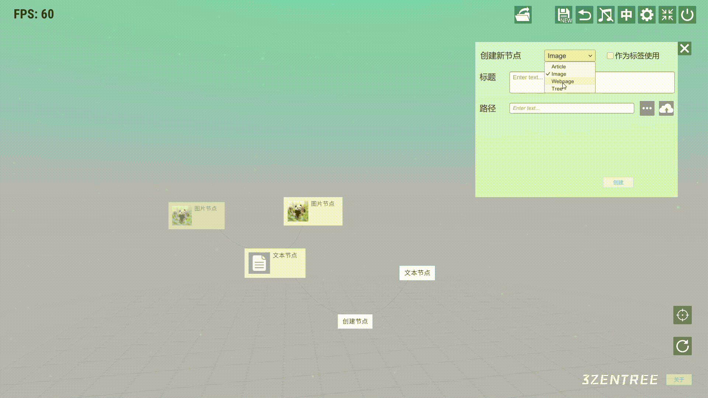

# 三生之树操作指南(v0.2b) - 创建结点

## 
创建结点

&emsp;&emsp;鼠标右键点击任意一个结点呼出子菜单并点击”+”号图标

* ## 文本结点
&emsp;&emsp;下拉框选择Article文本类型，输入标题和内容点击创建。点击勾选”作为标签使用”，会隐藏预览详情信息的功能。

* ## 图片结点
&emsp;&emsp;下拉框选择Image类型，先输入标题。点击”···”按钮可选择本地图片，点击云端的图标，可把图片上传到云端。同样也可以勾选作为标签使用。

* ## 网页结点
&emsp;&emsp;下拉框选择Webpage类型，复制或输入我们想要添加的网页链接，粘贴进链接输入框，然后点击”提取”，提取标题和缩略图完成后点击创建。（受部分网站限制，有时提取会失败，这里需要手动输入标题或缩略图（非必选））

## 视频演示
<iframe src="https://player.bilibili.com/player.html?aid=657575821&bvid=BV19a4y1w7QE&cid=1171785598&page=1" width="640" height="360" scrolling="no" border="0" frameborder="no" framespacing="0" allowfullscreen="true"> </iframe>
