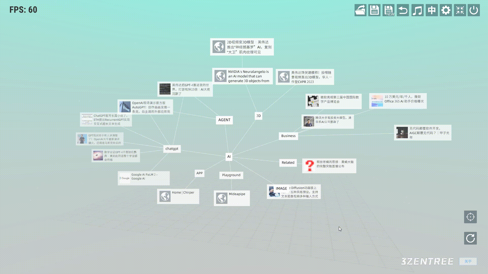

# 三生之树操作指南(v0.2b) - 全局操作

## 
全局操作

* ## 旋转树
&emsp;&emsp;鼠标左键持续按下并处于场景中空白区域后，进行横向左右滑动时，可将视角围绕树进行观察。

* ## 视角水平上下移动
&emsp;&emsp;鼠标右键持续按下并处于场景中空白区域后，进行横向或纵向移动时，视角会沿水平方向变化。

* ## 视角纵深变化
&emsp;&emsp;使用鼠标滚轮可以对视角在纵深范围进行变化。

* ## 视角重置
&emsp;&emsp;我们在进行了一系列移动、旋转和缩放的操作后造成树角中心，想要重置视角重新进行操作，那么此时可以点击右下角的重置按钮。

## 视频演示

<video width="580" height="340" controls>
  <source src="../videos/video2.mp4" type="video/mp4">
  Your browser does not support the video tag.
</video>
