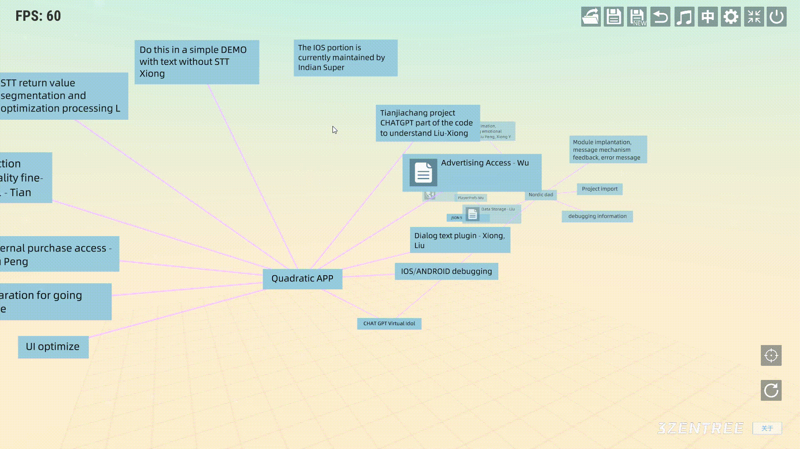
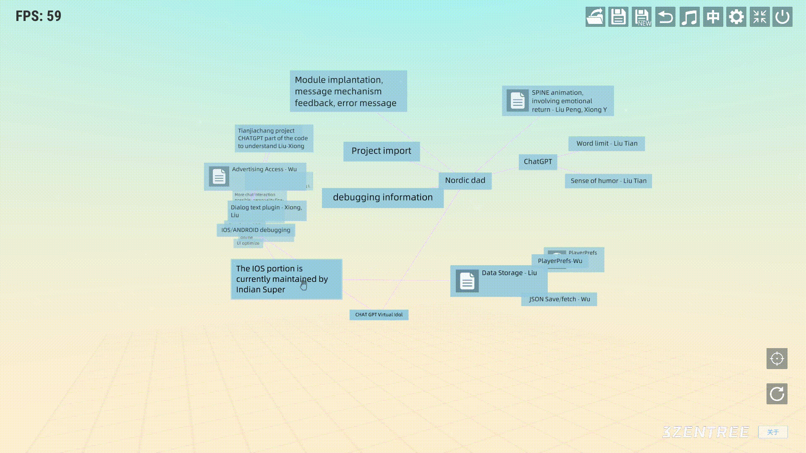

# 三生之树操作指南(v0.2b) - 连线

## 
连线

* ## 从结点关联父结点：
&emsp;&emsp;鼠标右键呼出结点子菜单，呼出子菜单后鼠标左键点击“箭头”图标，然后鼠标左键按住不放移动到想要连接的结点松开左键即可连接

* ## 删除连线：
&emsp;&emsp;鼠标放在想要删除的连接线上，会提示选中的连接线，然后按下鼠标右键即可删除连接线

## 视频演示
<a href="https://www.bilibili.com/video/BV1Uc411M7bp/?spm_id_from=333.337.search-card.all.click&vd_source=889ee3ee3ea16ab369623903dfaa87f4" target="_blank">全局操作</a>

