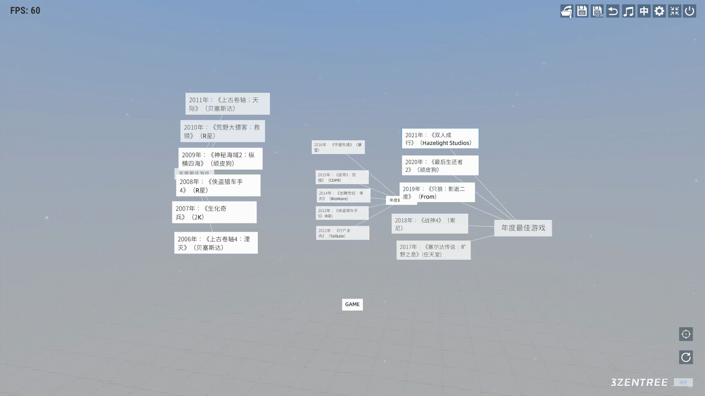
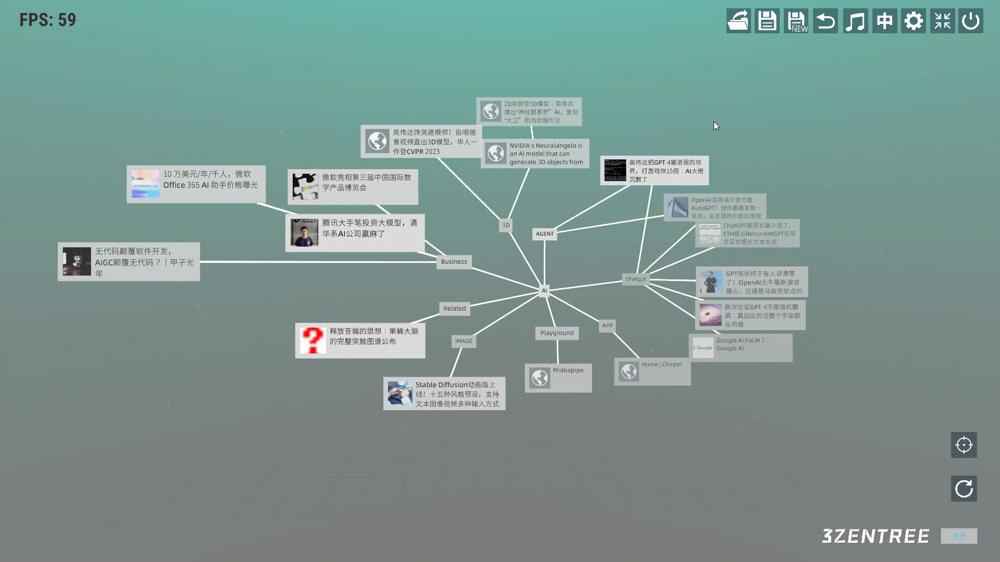
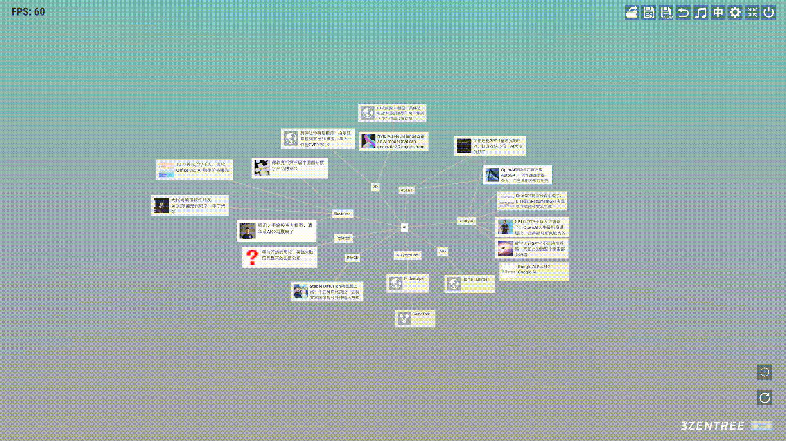
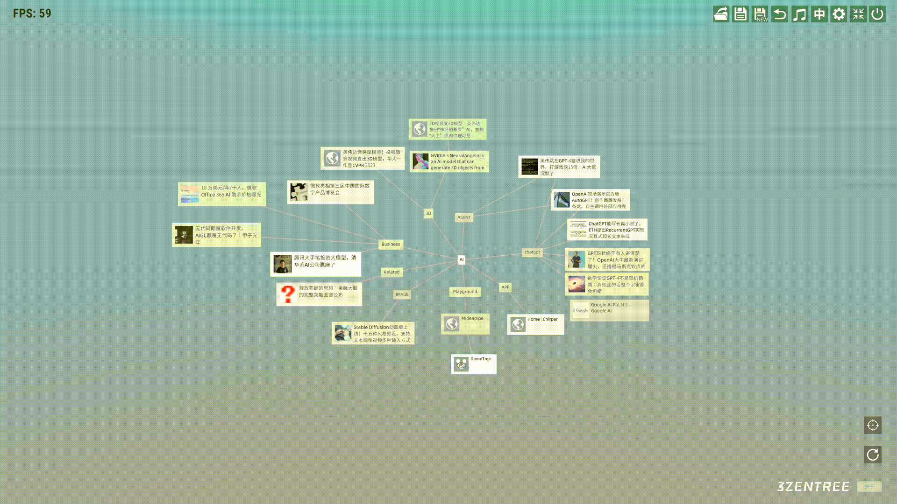
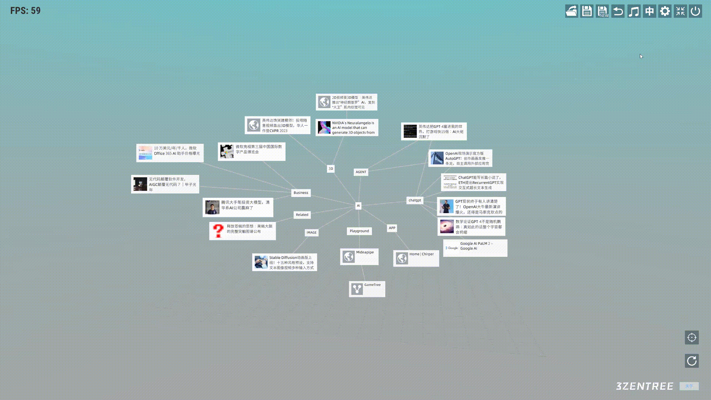
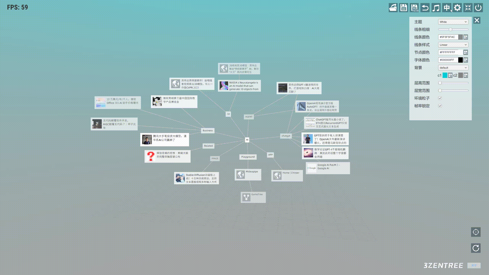
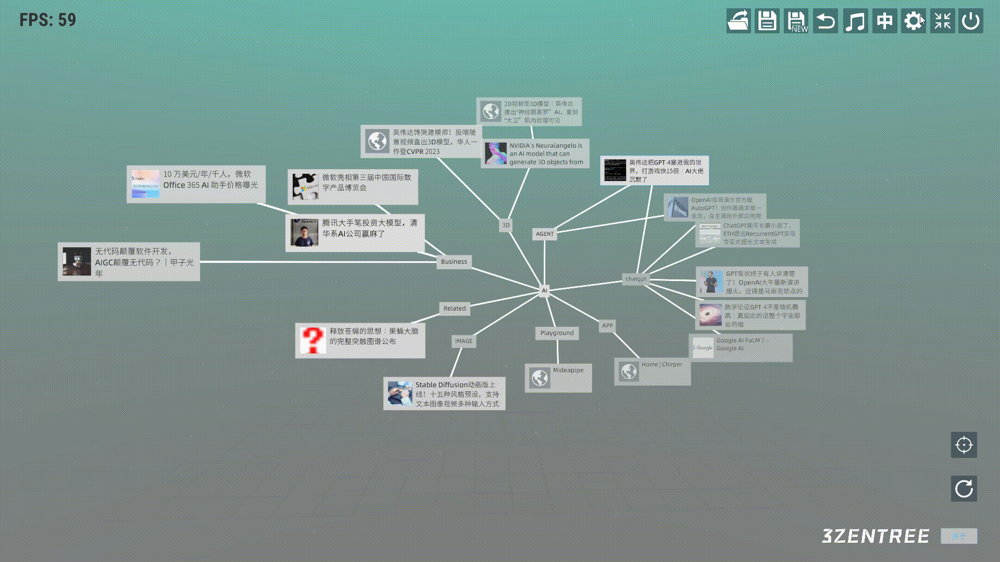
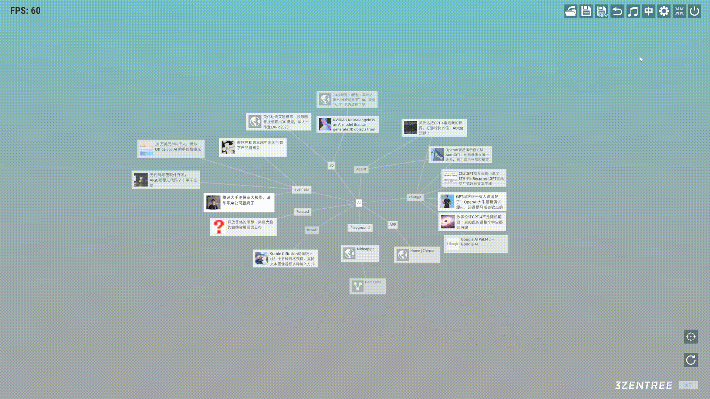

# 三生之树操作指南(v0.2b) - 导航菜单

## 
导航菜单

c在软件的右上方存在一系列按钮，从左至右它们的功能分别是：打开树、保存树、另存树、返回上一棵树、开关音乐、切换中英文、打开配置菜单、切换全屏、退出软件。

* ## 打开树

* ## 保存树

* ## 另存树

* ## 返回上一棵树

* ## 开关音乐

* ## 切换语言

* ## 打开配置菜单

* ## 切换全屏/窗口模式

* ## 退出软件

## 视频演示
<a href="https://www.bilibili.com/video/BV1uj411Q76r/?spm_id_from=333.337.search-card.all.click" target="_blank">全局操作</a>
