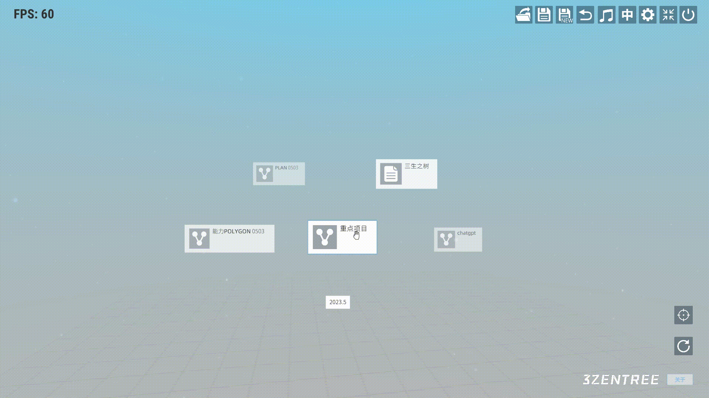
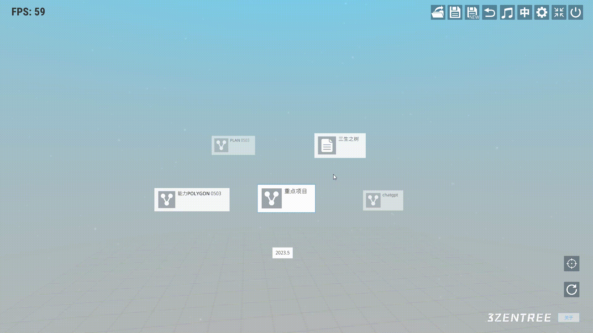
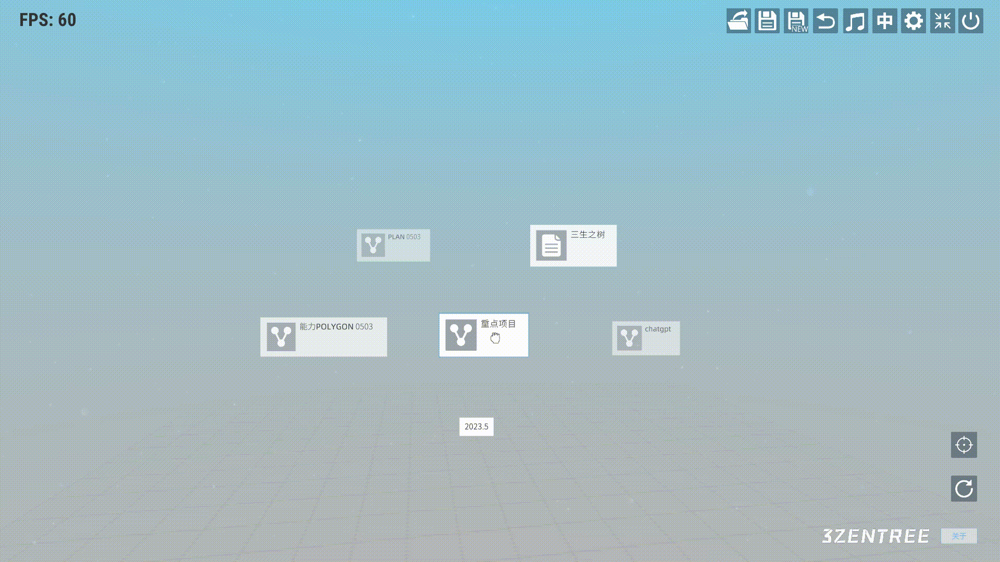

# 三生之树操作指南(v0.2b) - 结点交互

## 
结点交互

## 鼠标右键：

* #### 点开子菜单：

&emsp;&emsp;鼠标放置在结点上后，鼠标图标变为一个手掌，提示当前鼠标放置的结点。鼠标右键点击，鼠标图标变为抓握的手并弹出结点子菜单。

## 鼠标左键：

* #### 拖动：

&emsp;&emsp;鼠标放置在结点上后，鼠标图标变为一个手掌，提示当前鼠标放置的结点。当鼠标左键按下时，鼠标图标变为抓握的手，提示当前结点正在拖动。

* #### 点击查看详情：

&emsp;&emsp;鼠标放置到结点图标上时鼠标变为一个眼睛，提示该结点图标可点击。当鼠标左键点击，会弹出结点的详情。

## 鼠标左键+滚轮：

* #### 结点纵深变化：

&emsp;&emsp;鼠标左键点击鼠标变为一个抓握的拳头提示结点可以操作。当鼠标左键不松，滚轮向下滚动时结点拉近；当鼠标左键不松，当滚轮向上滑动时结点推远。

## 视频演示

<video width="580" height="340" controls>
  <source src="../videos/video2.mp4" type="video/mp4">
  Your browser does not support the video tag.
</video>
