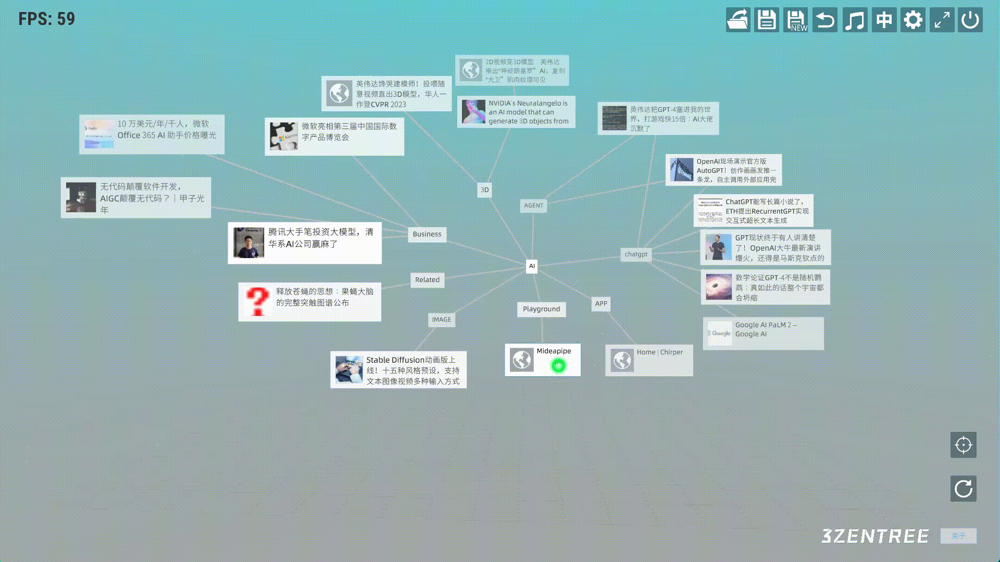
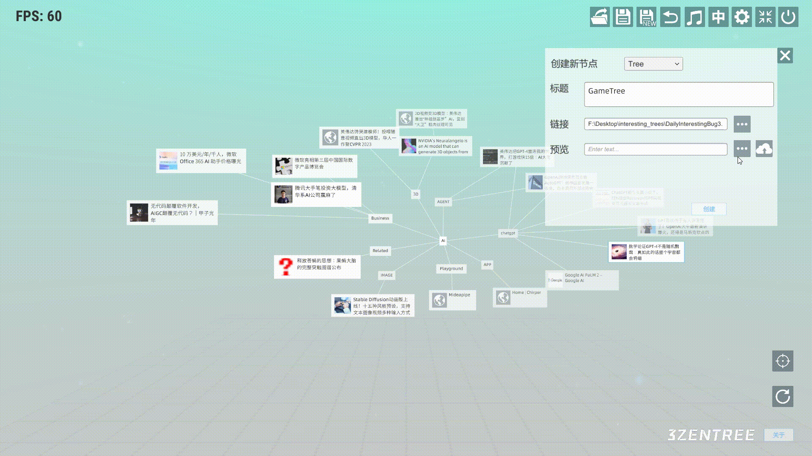
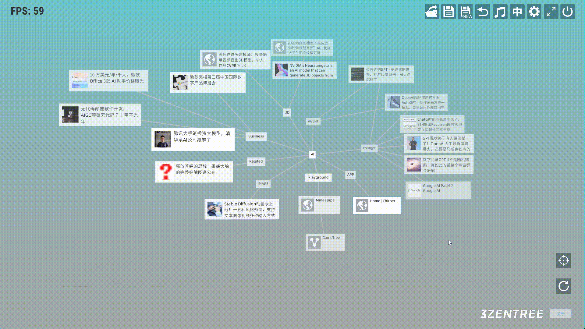

# 三生之树操作指南(v0.2b) - 树文件操作

## 
树文件操作

* ## 树链接
&emsp;&emsp;创建一个tree结点。我们右击任意结点，点击加号图标在弹出的面板上选择tree类型。输入标题，然后点击链接按钮选择需要链接的树文件，点击创建。

&emsp;&emsp;在预览栏选择的预览图片，预览图片支持云端存储。

* ## 返回上一棵关联树
&emsp;&emsp;点击Tree结点跳转到另外一颗树后，可以点击导航栏返回按纽返回上一颗树。

* ## 清空树
&emsp;&emsp;点击右下角的清空按钮清空当前树，相当于重建一棵空的树。

## 视频演示
<a href="https://www.bilibili.com/video/BV1bX4y1s73Y/?spm_id_from=333.788.recommend_more_video.2&vd_source=889ee3ee3ea16ab369623903dfaa87f4" target="_blank">全局操作</a>

